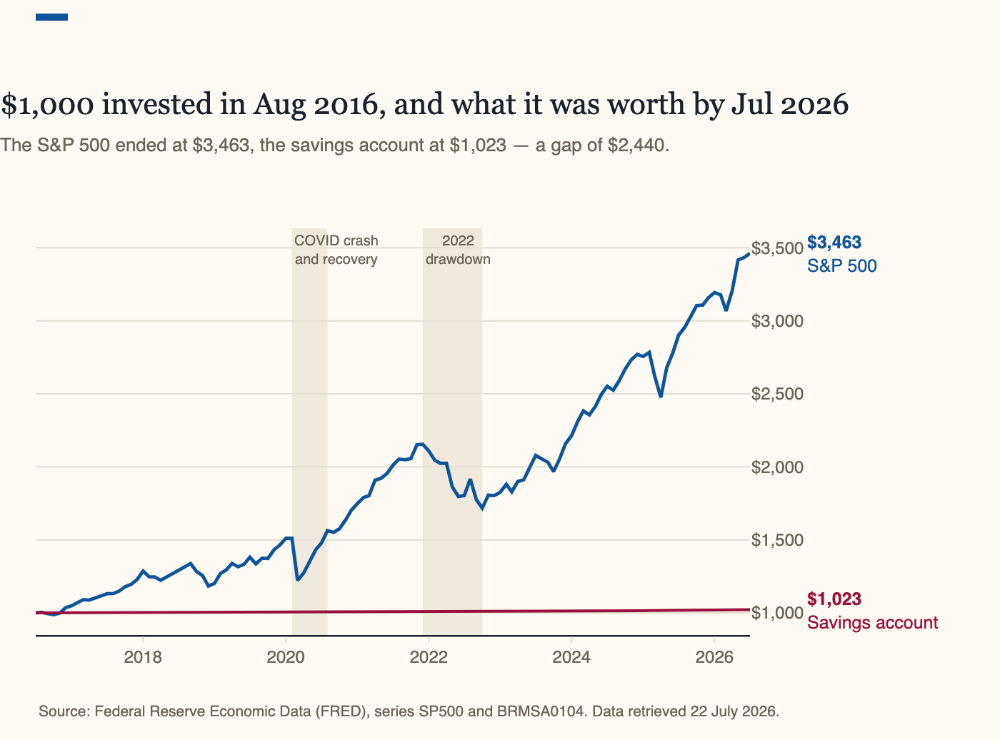
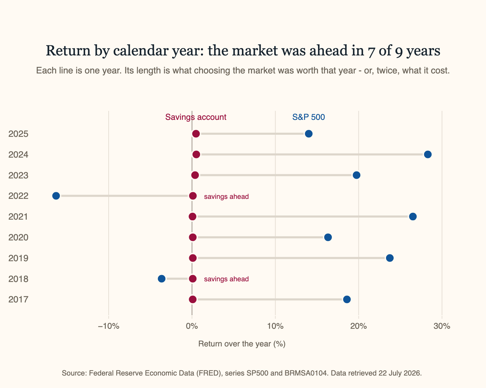

# S&P 500 vs. Savings Account: A 10-Year Comparison

*Šimon Rusko — `simonrusko-ux`*

## The question

**If I had put money into the S&P 500 ten years ago instead of leaving it in a
savings account, what would the difference be today?**

## Where the numbers come from

Both series were downloaded from FRED, the public data service run by the Federal Reserve Bank of St. Louis. The market side is the S&P 500, an index that tracks the share prices of five hundred of the largest companies listed in the United States. The savings side is the national average savings-account rate in the US, compiled by Bankrate from a weekly survey of the largest banks.

The comparison runs from August 2016 to July 2026, one hundred and twenty months — as far back as FRED's daily S&P 500 record goes. Everything here was downloaded on 22 July 2026 and is fixed to that date.

## Finding 1 — $1,000 became $3,463, or $1,023

$1,000 put into the S&P 500 in August 2016 was worth **$3,463** ten years later.
The same $1,000 left in a savings account was worth **$1,023**. The difference is
substantial: **$2,440** in total. The savings rate spent most of the decade
between 0.06% and 0.11% a year — a return that rounds to nothing once you have
waited ten years for it — while the S&P 500 kept compounding. There were sharp
falls along the way, in 2020 during the Covid-19 crash and again in the 2022
drawdown, but the market still finished far ahead of the savings account.

However, those falls were not small. The $1,000 stood at $1,511 in February 2020 
and at $1,223 a month later, and it did not climb back above that level until August.
<mark>From a peak of $2,155 in December 2021 it slid to $1,717 by October 2022
— a fifth of its value — and stayed down for most of a year.</mark> The savings line, by
contrast, did not fall in a single month out of a hundred and twenty.

<iframe src="finding1-growth.html" width="100%" height="525" frameborder="0"
        scrolling="no" style="border:0;"
        title="Value of $1,000 invested, 2016 to 2026"></iframe>

<!-- If the interactive chart above does not load, replace the iframe with:
      -->

## Finding 2 — the market won 7 years out of 9

*Disclosure: only the nine complete calendar years are compared here. The window
opens in August 2016 and closes in July 2026, so those two years hold five and
seven months, and a five-month year cannot be set against a full one.*

Across the nine years, the market finished ahead in **7**. It lost money in 2018,
at **-3.64%**, and again in 2022, at **-16.31%**, and in both of those years the
savings account was the better place to have been. The margins are nowhere near
equal, though: in its seven winning years the market returned between **14.01%**
and **28.30%**, while the savings account's best year was **0.52%**.
<mark>Losing twice cost far less than winning seven times gained.</mark>

<iframe src="finding2-by-year.html" width="100%" height="565" frameborder="0"
        scrolling="no" style="border:0;"
        title="Return by calendar year, 2017 to 2025"></iframe>

<!-- If the interactive chart above does not load, replace the iframe with:
      -->

## What it means

Over ten years, $1,000 in the market became $3,463. In a savings account, $1,023.
The market got you there, but made you sit through a ~20% fall and a sharper drop in 2020. The savings account never fell. <mark>That steadiness is what it was selling — and it cost $2,440.</mark>

However, none of this predicts the future. It's just what happened to money left alone in each place — one of which most people already have.

## What this comparison cannot tell you

This tracks a single payment, not monthly saving. Everything above follows $1,000
put in once and left alone. Pay in every month and you'd end up with more — but
mostly because you put more in, not because the return was better. That's a
different question this page doesn't answer.

The market figure is price-only, so it misses dividends — historically another 1.5–2% a year. Nothing is net of tax, fees or inflation either — $3,463 in 2026 doesn't buy what it did in 2016.

---

*Data: [FRED](https://fred.stlouisfed.org/), series `SP500` and `BRMSA0104`,
retrieved 22 July 2026. Analysis:
[`NB03-simonrusko-ux-Data-Analysis.ipynb`](https://github.com/simonrusko-ux/me204-final-project/blob/main/scripts/NB03-simonrusko-ux-Data-Analysis.ipynb).*
